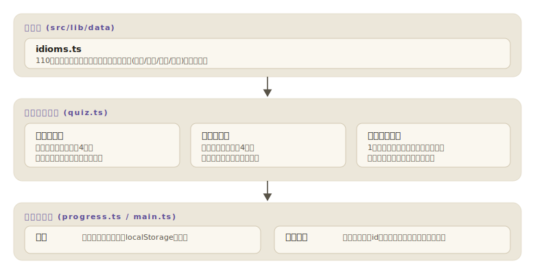

# yojijukugo

[](https://github.com/miruky/yojijukugo/actions/workflows/ci.yml)
[](https://github.com/miruky/yojijukugo/actions/workflows/deploy.yml)
[](https://www.typescriptlang.org/)
[](LICENSE)

**出典の解説つきで四字熟語を覚えるクイズ。意味・読み・虫食いの3モード、間違いを正解するまで再出題する苦手復習、検索できる辞典を備える**

デモ: https://miruky.github.io/yojijukugo/

## 概要

yojijukugoは、四字熟語110語を出題するクイズアプリである。モードは3つあり、意味クイズは意味文から語を選ぶ4択、読みクイズは「画竜点睛=がりょうてんせい」のような読みの4択、虫食いクイズは「温〇知新」の〇に入る漢字を選ぶ。語は升目(田の字)に明朝体で大きく示し、答えるたびに正誤だけでなく、語の由来(漢籍の故事・仏教語・日本由来・漢語表現)と出典の解説が表示される。「四面楚歌」なら、垓下に追い詰められた項羽が四方から楚の歌を聞いた、という故事まで読める。

間違えた問題は苦手リストに積まれ、復習モードで正解するまで同じ問題が再出題される。成績(正答率・連続正解)はlocalStorageに保存され、ブラウザを閉じても続きから練習できる。出題は由来でしぼり込め、漢籍の故事だけ、日本由来だけといった集中練習ができる。選んだ範囲は次回の起動にも引き継がれる。辞典タブでは全語を語・読み・意味・解説の横断で検索し、由来で絞り込める。出題中は数字キー(1〜4)で解答、Enterで次へ進める。表示テーマ(自動・ライト・ダーク)を切り替えられ、現在のモードと辞典の検索語はURLに残るので共有できる。成績はJSONで書き出し・読み込みできる。

出題には作り込みがある。収録語には「七転八起」と「七転八倒」のように1字違いの語があるため、虫食いの誤答を無造作に選ぶと正解が2つある問題ができてしまう。出題器は、当てはめると別の収録語が成立する漢字を誤答から除外する。このロジック自体をテストで保証している。

### なぜ作ったのか

四字熟語の一覧やクイズは多いが、「なぜその意味になるのか」まで添えるものは少ない。意味の丸暗記は剥がれやすく、項羽の故事を知っていれば四面楚歌は忘れない。また「一石二鳥は漢籍由来ではなく英語の諺の訳」のように、由来の分類自体が面白い知識なので、全語に由来の種別を付けて出題のたびに見せる作りにした。

## アーキテクチャ



## 技術スタック

| カテゴリ             | 技術                                         |
| :------------------- | :------------------------------------------- |
| 言語                 | TypeScript 5(strict)                         |
| 出題ロジック         | 実行時依存ゼロの純TypeScript(`src/lib`)      |
| UI・モーション       | バニラDOM + GSAP(prefers-reduced-motion尊重) |
| ビルド               | Vite 8                                       |
| テスト               | Vitest(node環境)                             |
| リンタ・フォーマッタ | ESLint(typescript-eslint)+ Prettier          |
| CI / 配信            | GitHub Actions / GitHub Pages                |

## 使い方

### 出題する

```ts
import { buildQuestion, createRng, idioms } from './src/lib';

const q = buildQuestion('fill', idioms, createRng(42));
// q.prompt      => '臥薪嘗〇' のような虫食い表示
// q.choices     => 4つの漢字(正解1つ+選別済みの誤答3つ)
// q.explanation => '臥薪嘗胆(がしんしょうたん): 目的を遂げるために...'
```

乱数はシード付き(mulberry32)で、同じシードからは同じ出題列が再現される。`buildQuestion('reading', idioms, rng, '画竜点睛')` と語を固定した出題もできる。

### 採点と苦手管理

```ts
import { emptyProgress, record, weakIds, rebuildFromId, createRng, idioms } from './src/lib';

let p = emptyProgress();
p = record(p, q.id, false); // 不正解 → 苦手に積まれる
weakIds(p); // => ['fill:臥薪嘗胆']

// 復習モードはidから同じ語・同じ形式の問題を組み立て直す
const again = rebuildFromId('fill:臥薪嘗胆', idioms, createRng(7));
p = record(p, q.id, true); // 正解すると苦手から消える
```

## プロジェクト構成

- `src/lib/data/idioms.ts` 110語の収録データ(読み・意味・由来分類・出典解説)
- `src/lib/quiz.ts` シード付き乱数と3種の出題(別解の混入防止)
- `src/lib/progress.ts` 成績・苦手リストの集計とlocalStorageへの保存
- `src/main.ts` タブ・出題・採点フィードバック・辞典のUI
- `src/theme.ts` 自動・ライト・ダークの配色切替
- `src/motion.ts` 入場・カウントアップのモーション(reduced-motion尊重)
- `src/url.ts` モードと辞典検索語のURLハッシュ同期
- `src/keys.ts` 出題画面のキーボード操作
- `src/icons.ts` ロゴほかモダンSVGアイコン
- `docs/` アーキテクチャ図

## はじめ方

### 前提条件

- Node.js 22以上

### セットアップ

```bash
git clone https://github.com/miruky/yojijukugo.git
cd yojijukugo
npm ci
npm run dev
```

### テスト・lint・ビルド

```bash
npm test
npm run lint
npm run build
```

### デプロイ

mainへのpushで `deploy.yml` がGitHub Pagesへ公開する。サブパス配信のためのbaseは環境変数 `YOJIJUKUGO_BASE` で渡す。

## 制約

- 収録は110語で、辞典の網羅を目指すものではない。意味と出典がはっきりした頻出語に絞っている。
- 出典の解説は通説に基づく要約で、由来に諸説ある語は「とされる」と書き、断定しない。由来がはっきりしない語は「漢語表現」に分類している。
- 読みは代表的なもの1つを正解とする。「けんどじゅうらい」のような慣用的な別読みは解説内で触れるに留める。

## 設計方針

- **根拠を添えて採点する** — 正誤だけでなく、語の意味と出典の解説を毎回表示する。覚えるべきは記号の対応ではなく物語のほうだという考えで作っている。
- **別解を誤答にしない** — 虫食いの誤答候補は、当てはめると別の収録語が成立しないか全数照合してから使う。「七転八〇」に起と倒が並ぶ事故を仕組みで防ぐ。
- **間違いは正解するまで残る** — 誤答は問題idごとに積まれ、正解で消える。復習モードはこのリストだけから出題する。
- **シード付き乱数** — 出題はすべて再現可能で、テストでは100シードを回して4択の不変条件(一意・正解の包含・別解非混入)を検査する。
- **動きは控えめに、止められる** — 入場の出現や成績のカウントアップにモーションを添えるが、`prefers-reduced-motion: reduce` のときは一切動かさず、要素は最初から見えた状態にする。
- **手と画面の両方で操る** — マウスでもキーボード(数字で解答・Enterで次へ)でも進められる。現在のモードと辞典の検索語はURLハッシュに載るので、特定の状態を共有・ブックマークできる。

## ライセンス

[MIT](LICENSE)
